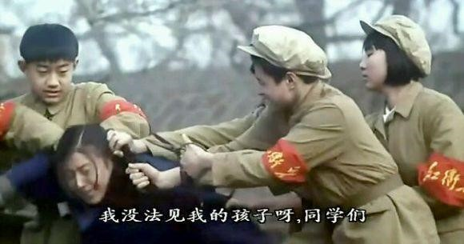
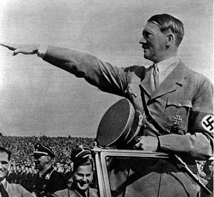

# 一个中国人是条龙，一群中国人是摊虫 #

《乌合之众》【法】[古斯塔夫·勒庞](http://baike.baidu.com/item/%E5%8F%A4%E6%96%AF%E5%A1%94%E5%A4%AB%C2%B7%E5%8B%92%E5%BA%9E "古斯塔夫·勒庞")著，[冯克利](http://baike.baidu.com/item/%E5%86%AF%E5%85%8B%E5%88%A9 "冯克利")译，[中央编译出版社](http://baike.baidu.com/item/%E4%B8%AD%E5%A4%AE%E7%BC%96%E8%AF%91%E5%87%BA%E7%89%88%E7%A4%BE "中央编译出版社")

早就断断续续终于读完了《乌合之众》，但一直没有时间整理摘要。据说这是广东省委推荐各级领导干部必读书指定读本之一。总体而言，此书内容比较枯燥，虽有史事举例，但都是西方史。对相关历史不了解的中国人较难体会。

此书最有价值的观点在于提出“**群体困境**”这一现象。大到全人类，小到三五个人，一个家庭，都会陷入群体困境。即，个人在融入群体后会丧失独立思考的能力，整个群体表现出感性、愚蠢、冲动、急躁、易被利用等特点，进而危害社会。虽然在论证这一现象产生的原因上，此书表现得比较外行，但群体困境这一普遍现象的存在是公认的，得到了广泛的肯定。

此书作者，勒庞，的许多观点在100多年后的今天依然非常适用。如：
> 群体的无意识行为代替了个人的有意识行为，是目前这个时代的主要特征之一。
> 
> 人既无理性又自私自利，易于冲动且反复无常，或者是把理性用在伤天害理的事情上。他既是暴力和虔诚骗局的实施者，又是它的牺牲品。
> 
> 群体中累加在一起的只有愚蠢而不是天生的智慧。（人越多越愚蠢）
> 
> 群体普遍冲动、易变、急躁、偏执、专横、保守、情绪夸张单纯、易受暗示、轻信谣言。
> 
> 传统的宗教、政治及社会信仰的毁灭，和技术发明给工业生产带来的巨变，是引发传统社会进入现代转型的主要原因。

很多人都有类似这样的体验：当自己的融入某个集体后，觉得自己得到了一种势不可挡的力量，这使自己敢于发泄出自本能的欲望，而在独自一人时，是必须对这些欲望加以限制的；当群体中有人大骂一句“xx贪污腐败”，所有人都瞬间表现出疾恶如仇的情绪，誓要生吃贪污犯。其程度足以使个人随时准备为集体利益牺牲一切。

可能有人会觉得这种随时准备为集体利益而牺牲的情绪表现出了群体道德的高尚。这完全错了。**道德是持久尊重一定的社会习俗，不断抑制私心的冲动**。由于群体太好冲动，太多变，因此它不可能是道德的。在群体中显著放大的只会是人性的阴暗面。如，欺软怕硬，只向严厉欺压他们的暴君低头；绝对地迷恋与崇敬一切传统；对一切有可能改变自身生活基本状态的新事物，有着根深蒂固的无意识恐惧。以名誉、光荣和爱国主义作为号召，最有可能影响到群体中的个人，而且经常可以达到使他慷慨赴死的地步。这些在无意识的情况下表现出的“美德”都不是真正的美德。（不过， 总得有人去当炮灰，就让这些愚蠢的傻子去吧。）
> “受激素影响而表现出的母爱是一种未经大脑思考挣扎的本能，和伟大毫无关系。”
> ——本文作者

每个人都有为了逃避孤独无助的感觉，而放弃自由的心理倾向。普通人缺乏对这种心理的自我认知，更未受过反制训练，所以被[权威主义人格](http://baike.baidu.com/item/%E6%9D%83%E5%A8%81%E4%B8%BB%E4%B9%89%E4%BA%BA%E6%A0%BC "权威主义人格")控制而无法清醒的概率更高。当个人融入群体，从众心理会愈演愈烈，直至完全占据头脑。同时，约束个人的道德和社会机制在狂热的群体中失去效力。人们只有避免去分析和批判，才能在群体眼里显得理所当然。那些保持独立思考的人反而会被认为是怪胎，显得格格不入。一个习惯于用推理和讨论的方式说明问题的人，在群体中是没有地位的。

群体所呼喊的口号也往往缺乏清晰的实际含义。也正是它们含糊不清，使得它们有了神秘的力量。例如**民主、社会主义、平等、自由等等，之所以具有神奇的威力，只是因为它们已经变成了空洞的政治口号**。各种极不相同的潜意识中的抱负及其实现的希望，好像全被这些口号集于一身。统治者的部分工作就是用新的名称代替那些能够让群众想起不利形象的名称，因为它们的新鲜能防止这种联想：“地租”变成了“土地税”，“盐赋”变成了“盐税”，“徭役”变成了间接摊派，商号和行会的税款变成了执照费。

**所有时代和所有国家的伟大政客，包括最专横的暴君，都把群众的想象力视为他们权力的基础（权力的来源）**。他们不会和群众讲理。群众的宿命就是被坑骗。影响民众想象力的，并不是事实本身，而是它们发生和引起注意的方式。掌握了影响群众想象力的艺术，也就掌握了统治他们的艺术。

群体更喜欢幻觉而不是真理。他们必须拥有自己的幻想，于是他们便像趋光的昆虫一样，本能地转向那些迎合他们需要的巧舌如簧者。**推动各民族<u>演化</u>的主要因素，永远不是真理，而是谬误**。

群体中的人会强烈意识到自己要为一个“更崇高的事业”负责。在这种责任意识的激励下，他会不自觉地自我渺小化，把自己日常经营的目标与它对立起来，从而**理所当然地认为，别人的个人目标同样也是没有价值的**。缺了英雄的群体在大多数情况下只能算是一些朝生暮死的“群氓”。

群体的心理过程中并没有多少逻辑成分。群体推理的特点是：把彼此不同、只在表面上相似的事物搅在一起，并且立刻把具体的事物普遍化。比如说“吃脑补脑”、“核桃补脑”。仅仅因为外形长得像，就会被愚蠢的人牵强附会。别有所图的人非常善于利用这点忽悠群体。

这也正是领袖赢得群众信任的重要条件。领袖在很大程度上能够改变甚至**制造人民的意志**（**洗脑**）。**夸大其辞、言之凿凿、不断重复，绝对不以说理的方式证明任何事情，是说服群众的不二法门**（传染法、断言法、重复法）。“重复是一种力量，谎言重复一百次就会成为真理”（戈培尔效应）。要想领导群体，就要去寻找那些能让他们动心的事情、能够诱惑他们的东西，而不能根据建立在纯粹平等学说上的原则。所以领袖在做动员工作时，通常会作出简洁有力的断言，不理睬任何推理和证据。一个断言越是简单明了，证据和证明看上去越贫乏，它就越有煽动群众的威力。
> “你以为自己有独立思考能力，其实是别人有意引导，使你以为自己有独立思考的能力。”
> ——本文作者

（保健品都是骗钱的）

以人民主权的名义并由人民进行的革命，是不可能使一个民族获得自由的。采用激进的方式，借助于抽象的原则贯彻一种社会改造的蓝图，只会使社会文明大幅倒退。世界历史上纯粹的农民起义都以失败告终。因为群体不善推理，却急于采取行动。**创造和领导着文明的，历来就是少数知识贵族而不是群体**。

群体只有强大的破坏力。群众的民主权力就像一切个人权力一样，当它没有受到恰当的宪政约束时，也很容易转变为它的反面，成为一种暴虐的权力。大众民主与独裁只有一步之遥。进入狂热状态的群体是无法正常沟通的。所以直接武力镇压往往是平息群体暴乱的第一步。

当一种文明让群众占了上风时，它便几乎没有多少机会再延续下去了。如果说还有什么事情能够推迟自身毁灭的话，那就是极不稳定的群众意见，以及他们对一切普遍信仰的麻不不仁。

很多人以为我国法律是人民代表开大会制定的。其实优秀法律的作者都是专家，他们是在自己安静的书房里拟定草稿的。法律是个人的产物而不是集体的产物。开会只是表决通过这些法律。**群体的观念总是落后于博学之士和哲学家好几代人**。今天所有的政客都十分清楚群体基础观念中的错误，然而由于这些观念的影响力依然十分强大，他们也不得不**根据自己已经不再相信的错误原则进行统治**。社会组织就像一切生命有机体一样复杂，我们还不具备强迫它们在突然之间发生深刻变革的智力，只有时间具备这样的力量。

绝大多数人都不具备看懂国家政府大会的基本功。比如，今天领导说农业很重要，农业是根本，就觉得国家要扶持农业。明天领导说教育很重要，教育是未来，就觉得教育经费会大大提高。没有经验的人就极容易听风就是雨，甚至把谣言当令箭。其实明白人都知道，农业、教育、经济、军事等等都非常重要，但是短期内不可能把每个都当作重点，肯定会有最重要的方向。最高领导不可能把国家治理当儿戏，朝令夕改。大多数发言只是安抚一下各方面的情绪，转移注意力，见人说人话，见鬼说鬼话。就像护士给病人打针，会聊几句天，挠挠病人屁股；该打的针，毫不手软，一击必中。

（坚持无脑投赞同票的人大代表也真的一无是处）

勒庞也预见到了群众日益被大众文化所湮没，这种文化把平庸低俗当作最有价值的东西。当今混乱的传统文化市场、低俗电视节目都绝佳印证了这个预言。《弟子规》这种充斥着腐朽陈规的糟粕居然会成为小学生必背古文。“快手”这个直播APP简直就是一面引妖出洞的照妖镜。甚至有人评价这款APP是对东北人的高级黑。

（“女德”骗子——丁璇）

（价值观扭曲的“快手”视频“演员”）

----------

**个人福祉是集体的目的，是集体存在的理由；组建一个家庭是为了让自己过得更好，组建一个国家是为了让自己的小家过得更好。**自私才是社会进步的动力（只是少有人愿意公开承认自己自私）。

真正**有益**的团体应该是每个成员之间保持松散的弱连接，但又敢于且乐于批评与自我批评。这种团体的首要条件就应该是所有成员各自经济独立（物质决定意识）。他们聚集在一起就是基于兴趣爱好，肆意展现自己的才能，突破自我。甚至要抛弃所有感情，只剩理性。这些人在该团体中寻求的应该是自我实现，甚至是超越自我，即马斯洛需求金字塔的第五和第六层。

一般来说，任由其它队友犯错不当面批评指正的成员，肯定心里排斥这个团体，所以才会无视其他成员腐朽，遭人嫌。

如何判断一个团体是不是乌合之众？只要有人想在这个团体中满足其它层次的需求，就是乌合之众。

（马斯洛需求金字塔）

用电影《鹿鼎记》中陈近南向韦小宝做思想工作时的对话结尾。
> 陈近南：“读过书，明事理的人，大多数已经在清廷里面当官了。所以，如果我们要对抗清廷，就要用一些蠢一点的人。对付那些蠢人，就绝不可以跟他们说真话。必须要用宗教形式来催眠他们，使他们觉得所做的事情都是对的。所以‘反清复明’只不过是一句口号，跟‘阿弥陀佛’其实是一样。清朝一直欺压我们汉人，抢走我们的银两跟女人，所以我们要反清。”
> 
> 韦小宝：“要反清抢回我们的银两和女人，是不是？复不复明根本就是脱裤子放屁，关人鸟事。行了，大家聪明人，了解。”

思考题1：国内哪个宗教的势力最大？

思考题2：提利昂和瓦里斯的对话（国王 僧侣 富商 佣兵）
> 瓦里斯：三位贵人坐在一个房间中，一个国君，一个僧侣，一个富翁。三人之间站着一名普通佣兵。每位贵人都命令佣兵杀死另外二人。孰生，孰死？
> 
> 提利昂：那要视那个佣兵而定。
> 
> 瓦里斯：是吗？他既没有王冠，也无金银珠宝，更没有诸神的眷顾。
> 
> 提利昂：他有利剑，有决定生死的力量。
> 
> 瓦里斯：既然生死取决于佣兵，我们又为何假装承认国王的权力至高无上呢？力量存于人心，信则有，不信则无。这是惑人的把戏，如浮影游墙。

